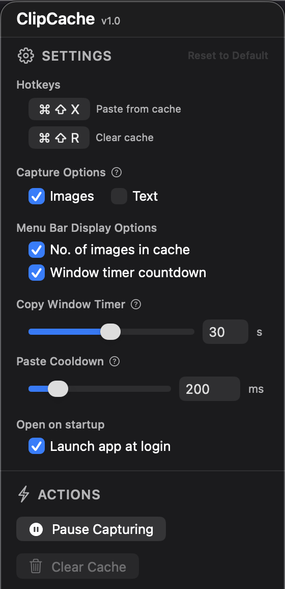

# ClipCache

#### ClipCache is a lightweight macOS menu bar app that lets you copy multiple images and text snippets, then paste them all at once with a single keyboard shortcut. It works alongside your native copy/paste shortcuts without replace them.

  

## ‼️ Installation

1. Download and unzip the latest release.
2. If macOS blocks the app, click "Done", go to **System Settings → Privacy & Security → Allow Anyway**, then reopen ClipCache.
3. Grant accessibility permissions when prompted.
4. Start copying and pasting!

## ⚠️ Setting Up Screenshots to Copy to Clipboard

To automatically copy screenshots to your clipboard (instead of saving files):

1. Press `Cmd+Shift+5` to open native macOS screenshot options
2. In the options bar at the bottom, click "Options"
3. Under "Save to", select "Clipboard"
4. Now when you take screenshots with `Cmd+Shift+4` (or `Cmd+Shift+3`), they'll automatically copy to clipboard and be captured by ClipCache.

   _`⚠️You can revert this at any time by changing back to your preferred save location.`_

## Usage

### Basic Flow

1. **Take any number of screenshots or copy any number of text snippets** within the copy window timeframe
2. **Paste them all at once** using the paste shortcut (default: `Cmd+Shift+X`) 📋
   - All items in the cache will be pasted in sequence
   - Images are pasted first, then text items
   - Each item is pasted with a configurable cooldown delay (default: 200ms)
3. **Clear the cache** when needed:
   - The cache automatically resets when you copy something new after the copy window has closed
   - Use the clear shortcut (default: `Cmd+Shift+R`)
   - Or click "Clear Cache" in the menu

### Menu Bar

Click the ClipCache icon in your menu bar to access:

- **Settings**: Configure shortcuts, capture options, menu bar display, and more
- **Actions**: Start/stop capture, clear cache
- **Quit**: Exit the app

### Keyboard Shortcuts

- **Paste Cache** (default: `Cmd+Shift+X`): Pastes all items in the cache sequentially
- **Clear Cache** (default: `Cmd+Shift+R`): Clears the current cache

Both shortcuts can be customized in Settings → Hotkeys.

## How It Works

ClipCache monitors your clipboard and groups copied items into batches using a "copy window" system:

1. **Copy Window**: When you copy the first item, a time window opens (default: 30 seconds)
2. **Window Extension**: Any additional copies within this window extend the timer and add to the cache
3. **Persistent Cache**: After the window closes, the cache stays available indefinitely
4. **Reset on New Copy**: When you copy something new after the window has closed, the cache resets and a new window begins

### What Is the Copy Window?

The copy window is a short countdown timer that starts every time you copy something.

**While the timer is running:**

- Anything you copy is added to the same group
- Copying something extends the timer
- Once the timer expires, the group is "complete"

**Example:**

1. Copy image → timer starts
2. Copy text → timer extends
3. Copy screenshot → timer extends
4. Stop copying → timer expires → batch ready
5. Press Paste → all 3 items paste in order

This design allows you to:

- Copy multiple items in quick succession (screenshots, text snippets, etc.)
- Paste them all later using a single keyboard shortcut
- Keep your cache available until you're ready to start a new batch

## Features

- **Smart Copy Window**: Groups related copies together automatically 🪟
- **Image & Text Support**: Captures both images and text (configurable) 🖼️
- **Menu Bar Display**: Optional display of image count and timer countdown 📊
- **Configurable Settings**:
  - Copy window duration (1-60 seconds)
  - Paste cooldown delay (50-1000ms)
  - Keyboard shortcuts for paste and clear
  - Capture options (images/text)
  - Menu bar display options
  - Launch on startup
- **Auto-start**: Begins capturing automatically when launched

## Requirements

- macOS 12.0 or later
- Accessibility permissions (required for global keyboard shortcuts)

The app will prompt you to grant accessibility permissions on first launch.

## Settings

Access settings via the menu bar icon:

- **Hotkeys**: Customize keyboard shortcuts for paste and clear
- **Capture Options**: Choose what to capture (images, text, or both)
- **Menu Bar Display**: Show/hide image count and timer countdown
- **Copy Window Timer**: Adjust the time window duration (1-60 seconds)
- **Paste Cooldown**: Adjust delay between pastes (50-1000ms)
- **Open on Startup**: Launch ClipCache automatically when you log in

## License

Copyright © Will Whitehead 2025
